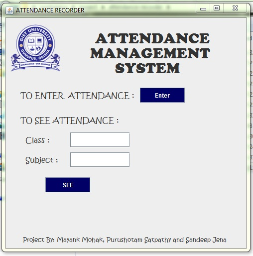
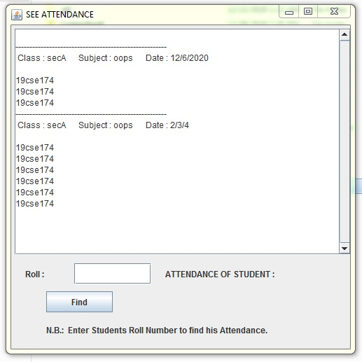
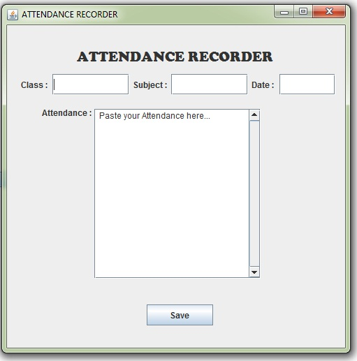

<h1 align="center">Attendance Recorder 👋</h1>
 

  
  
  

## ❓ What is this project about?

It makes recording attendance easy and also save time in online classes (meets), company meetings, seminars very easily, with few clicks.

This project is based on file handling concept in java. The attendance scripts input by user is stored in respective files for every classes and subjects.

## :thinking: Need of this Project

Curently in our online classes The Attendance is recorded manually which is very much time taking and also very much old fashioned.

## :heavy_check_mark: Solution

We came up with a solution that all attendees of the class have to text "hi" in the chat box, which Teacher can copy & paste in our software and the attendance will we recorded. That’s it.
It now hardly takes 1-2 min to do that.

## :computer: Technologies used here:
  - Framework: [spring](https://www.javatpoint.com/spring-tutorial)
  - [AWT](https://www.javatpoint.com/java-awt) Abstract Windowing Toolkit in JAVA
  - File Handling in JAVA

## :camera_flash: Screenshots
* Home 

  
* View Attendance 

* Record Attendance 

* Contact Us 
  Want to use this project mail us at [mayank8199@gmail.com](mailto:mayank8199@gmail.com)

## :computer: How to run this Project
  - Download and Unzip file on your local system
  - Open terminal Run command "javac attendance.java && java attendance"
  
  
## 🤝 Contributing
Comments and improvements are more than welcome!

Feel free to fork and open a pull request.
>note: please open an issue before making PR as a good practice of open source.

## 🙌 Show your support

Give a ⭐️ if you liked this work!

